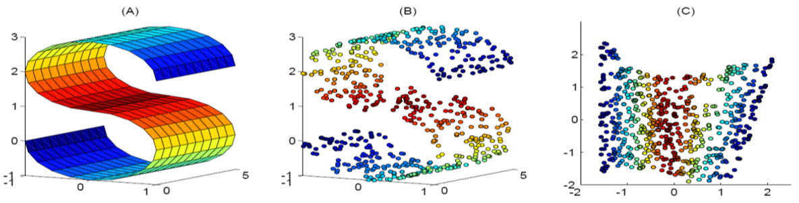
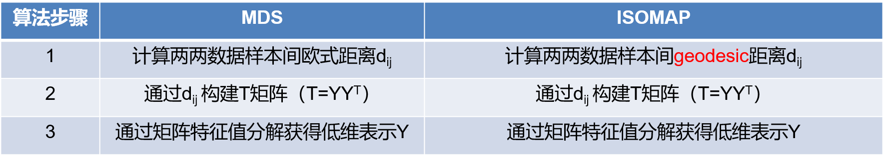
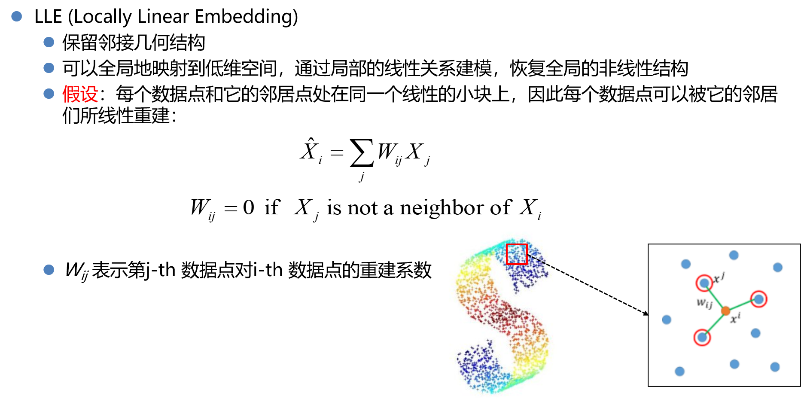

## 数据降维

概览：

三种重建方式，损失函数构建不同

* 数据重建

  * PCA

* 距离重建

  * MDS
  * ISOMAP

* 关系重建

  * LLE

  

算法推导只需要PCA

### 数据重建

#### PCA

目的：降维重建后的数据与原始数据的差距最小

### 距离重建

#### MDS

目的：找到映射方向使得在低维空间中高维度样本间距离不变

#### ISOMAP

**背景**

如果数据集拥有非线性的结构，那么线性方法如PCA和MDS等均不能有效工作，非线性的数据降维方法因此应运而生。

ISOMAP (Isometric feature Mapping) 保留数据集的本征几何结构，每两个数据点之间计算测地线距离（区别与Euclidean距离）。

测地线geodesic距离(dijstra 计算最短路径)

MDS和ISOMAP：区别只在于距离

### 关系重建

### LLE

认为每个点都可以通过其邻居线性组合获得

优化目标

### 算法过程

* 计算各领居的权重 $w_{ij}$

### 总结

* ISOMAP

  ISOMAP与MDS相似，两两点之间使用测地线距离代替Euclidean Distance。

* LLE和ISOMAP是非线性的降维方式，没有显式的映射函数，因此无法处理新数据。

  * 解决方案：根据降维前后的输入输出pair来做线性回归或训练神经网络。

* LLE和ISOMAP保留了邻接的几何结构。

* LLE需要更多的训练数据，ISOMAP计算效率高，实用性更高