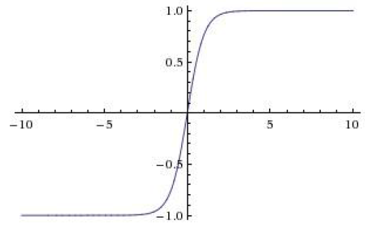

## 神经网络

### 感知机模型

### 非线性激活函数

* 阶跃函数

* Sigmoid

  

  $$
  f(x) = \frac{1}{1+e^{-ax}}\\
  注：f'(x)=a(1-f(x))f(x)
  $$
  
  缺陷：
  
  * 不关于0对称
  
  * 在大的正数和负数作为输入的时候，梯度就会变成零，出现梯度消失。
  * 只有正数输出。
  
* tanh

  

  优点：关于原点对称
  缺陷：仍然有梯度饱和现象

  

* Relu
  
  
  $$
  f(x)=\max(0,x)
  $$
  
  解决了Sigmoid梯度消失的问题，但负数区梯度为0。
  
* LeakyRelu

   
   $$
  f(x)=\max(0.01x,x)
  $$

### Softmax

### MLP 多层感知机

#### 前向计算

若第$l-1$层输出为$a^{l-1}$,第$l$权重$w^l$ bias $b^l$, 激活函数$\sigma$，则第$l$层输出为$a^{l}$
$$
a^l=\sigma(w^la^{l-1}+b^l)\\
$$

### 反向传播BP

梯度逐层传递，链式法则

例题：

* 梯度消失

  原因：激化函数有梯度为0的区域

  办法：换激活函数 relu、LeakyRelu

* 梯度爆炸

  原因：
  
  * 隐藏层的层数过多
  * 权重的初始化值过大
  
  办法： 
  
  * 选择relu等梯度大部分落在常数上的激活函数
  * 用 Batch-Normalization

### 训练流程

* 初始化，随机初始化权重

* 重复：
  * 前向：计算网络输出 $L$
  * 反向传播：更新各层权重 $w\leftarrow w-\eta \frac{\part L}{\part w}$

### loss function

交叉熵（分类问题较好）、mse

初始化：不能初始化成一样的，随机初始化

### 训练技巧

dropout

原理：每次dropout对应一种新的网络模型，即集成学习，降低了方差。

还有几种训练技巧：moment wait-deccay？

