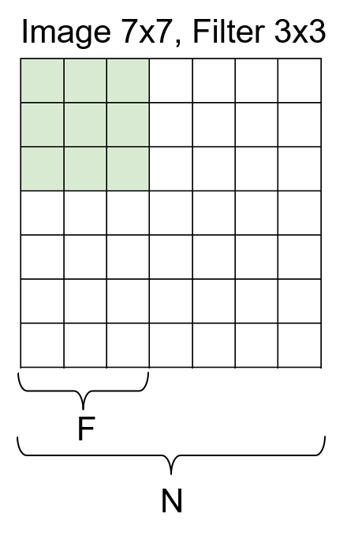
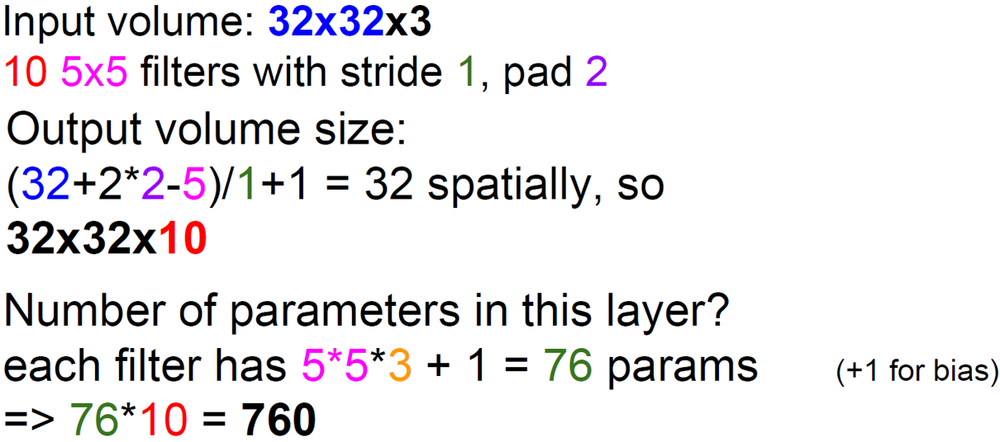

## CNN

### 卷积

#### 卷积层中输入与输出的关系

Formula for output size: 
$$
output\ size = \frac{N-F}{stride}+1
$$
例：

#### 可学习的参数

可学习：

* 卷积层conv可学习/maxpooling不可/
* BN（Batch Normalization)可/
* FC（全连接）可

不可学习：

* maxpooling 池化层不可

**imagnet模型**+**新的图片**

把最后一层删掉，重新调整最后一层的输出，输入新的数据，更新模型（前面层步长小，后面大） 