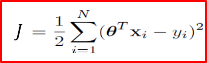
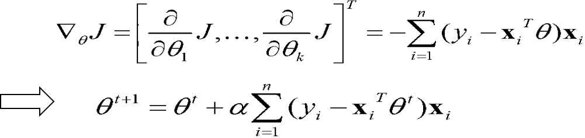
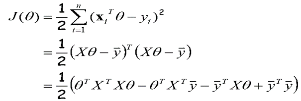
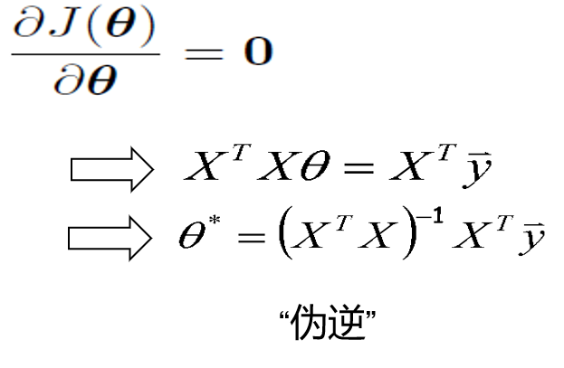
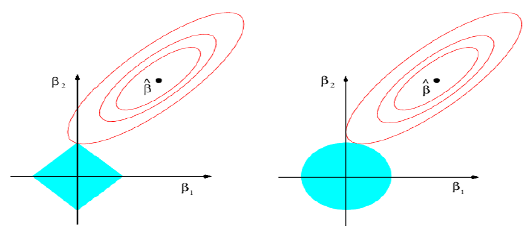

## 2-回归分析

### 线性回归

寻找从x到y的关系 $\theta$
$$
Y=X\theta， X:N*d
$$

#### 梯度下降

**优化目标，公式推导：**

#### 伪逆

线性回归两种方法：

* 梯度下降
  * 收敛快
* 伪逆
  * single-shot，易实现
  * 缺点：伪逆计算量大，数值不稳定

### 正则化

#### 岭回归

给线性加一个L2的约束

#### Lasso 稀疏约束

给线性加一个L1的约束

solve lasso 不考虑， 见ppt

#### 几何意义

* Ridge: 限制在一个圆内，解不稀疏。

* Lasso: 容易走到边角，解稀疏，可以用来减少冗余。

* 较大的$\lambda$会导致解$\theta$ 变稀疏，$\lambda$为0时变为线性回归，采用交叉验证来取 $\lambda$。

| 距离 | 方法      | 限制                |
| ---- | --------- | ------------------- |
| L2   | Ridge回归 | $\lambda ||w||_2^2$ |
| L1   | Lasso回归 | $\lambda||w||$      |

**逻辑回归是分类算法**