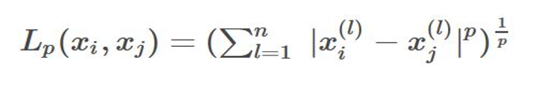
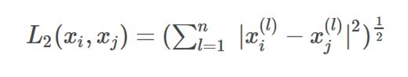
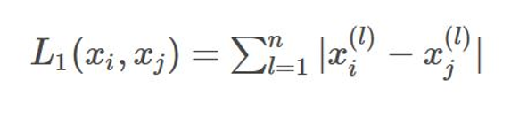
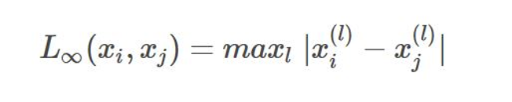
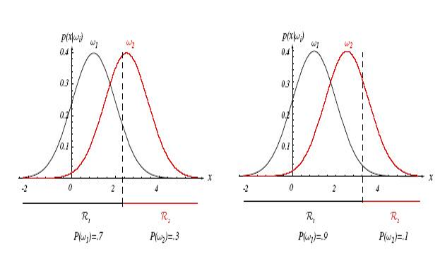

## 3-KNN_贝叶斯

### KNN

k个最近的邻居，即每个样本都可以用它最接近的k个邻居来代表（投票）。

算法流程：

1） 计算已知类别数据集中的点与当前点之间的距离
2） 按距离递增次序排序
3） 选取与当前点距离最小的k个点
4） 统计前k个点所在的类别出现的频率
5） 返回前k个点出现频率最高的类别作为当前点的预测分类

knn的重点 **K值的选取**和**点距离的计算**。

#### 距离度量

$L_p$范数

欧氏距离：p = 2范数

曼哈顿距离：p = 1范数

无穷范数：p$=\infty$

#### k的选取

首先如果只是两类问题分类，k一定为奇数

**交叉验证**

通过交叉验证（将样本数据按照一定比例，拆分出训练用的数据和验证用的数据，比如6：4拆分出部分训练数据和验证数据），从选取一个较小的K值开始，不断增加K的值，然后计算验证集合的方差，最终找到一个比较合适的K值。

#### 并行化

Mapreduce + merge sort

先map到不同的电脑上计算距离，然后merge sort排序

### 贝叶斯

通过先验概率得到后验概率：
$$
p(x_i|y) = p(x_i,y)/p(y) =\frac{p(x_i)*p(y|x_i)}{p(y)}
$$

Posterior  =  (likelihood * Prior) / evidence

**决策边界**

显然 $w_1$上升时，决策边界右移。

#### 贝叶斯决策

**状态+行为+损失**

令$\{w_1,w_2\dots,w_c\}$为 $c$个自然状态的集合 (或“类别”)

令 $\{\alpha_1,\alpha_2\dots,\alpha_a\}$表示可能行动的集合

令 $\lambda(\alpha_i|w_j)$表示在自然状态为$w_j$的情况下因采取行动而产生的损失

##### **二分类**

##### **参数检验**

极大似然法则

