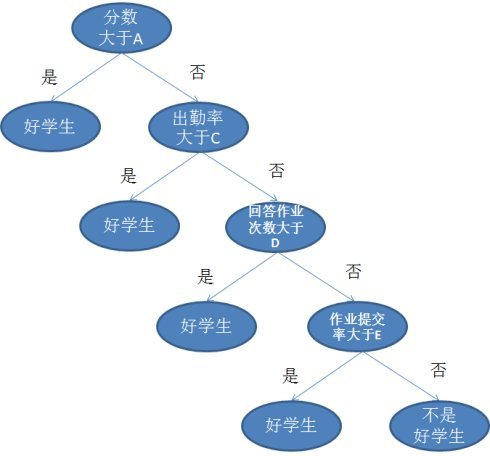
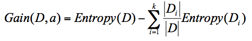
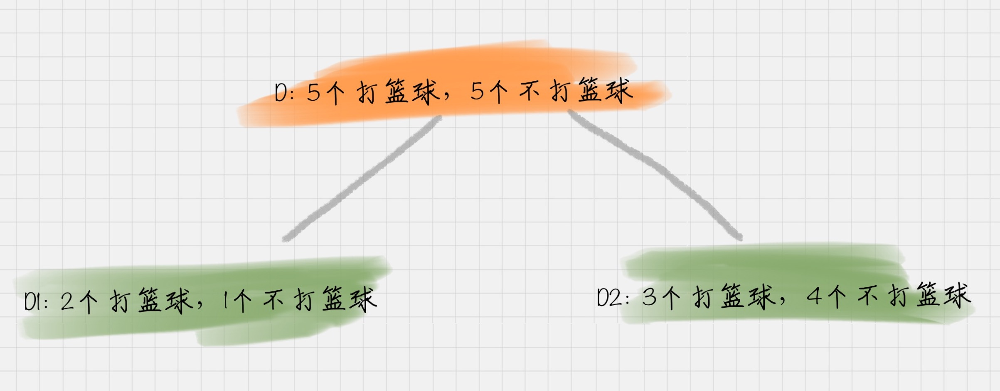
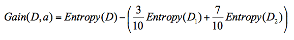
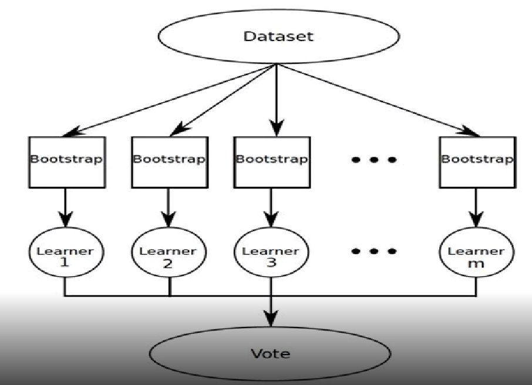

## 决策树、集成学习、随机森林

### 决策树

**一种有监督训练的分类算法** 

决策树是一种树形结构，其中每个内部节点表示一个属性上的判断，每个分支代表一个判断结果的输出，最后每个叶节点代表一种分类结果。

结构类似如下：

#### 树的构建规则：熵的增益即信息增益最大(ID3算法)

**信息增益：**

信息增益指的就是划分可以信息熵的下降。它的计算公式，是**父亲节点的信息熵减去所有子节点的信息熵**。

例：

假设D 总计的情况， 5 次去打篮球，5 次不打篮球。其中 D1 刮风 = 是，有 2 次打篮球，1 次不打篮球。D2 刮风 = 否，有 3 次打篮球，4 次不打篮球。那么当我们选择刮风为节点判断时，信息增益为：

​                                                                        
$$
=1-0.3*(\frac{1}{3}log(\frac{1}{3})+\frac{2}{3}log(\frac{2}{3}))-0.7*(\frac{3}{7}log(\frac{3}{7})+\frac{4}{7}log(\frac{4}{7}))
$$
注：决策树的构建

### 集成学习(Bagging)

* 集成学习：提高分类器表现的方案，减小方差
* 一串弱分类器，强分类器可能导致overfitting
  * 强/弱分类器：分类准确率高低

### 随机森林

随机森林就是通过集成学习的思想将多棵树集成的一种算法，它的基本单元是决策树，即随机森林=决策树+集成学习

* 每一颗数据训练的数据：自助法采样

* 参数：树的深度、多少颗树

* why it work？ 集成算法-------》降低方差
* 应用：body pose estimate

