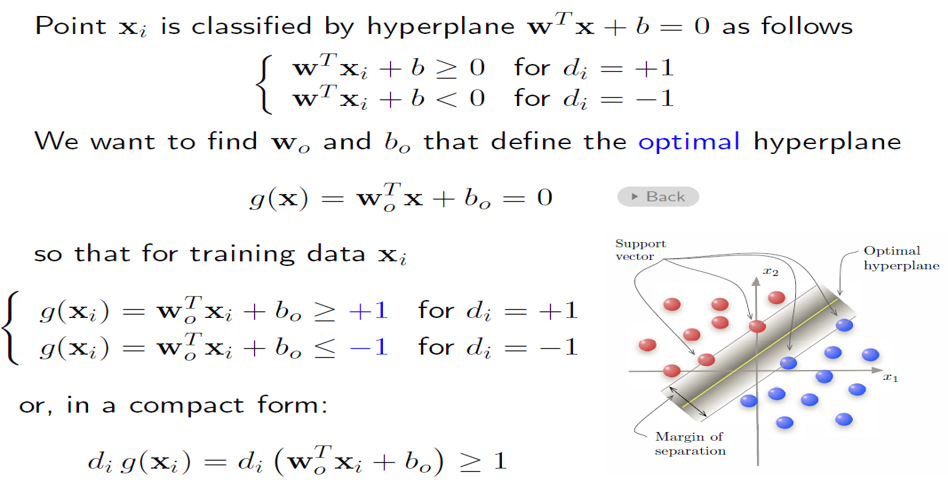
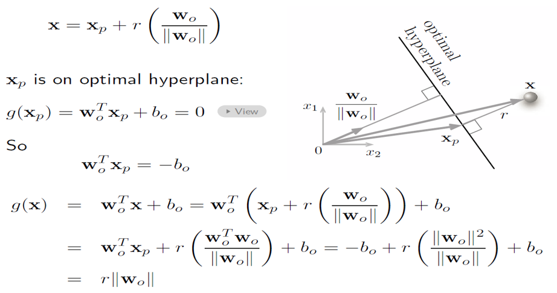
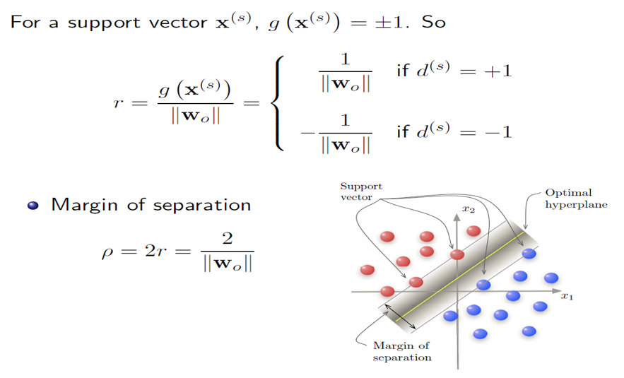
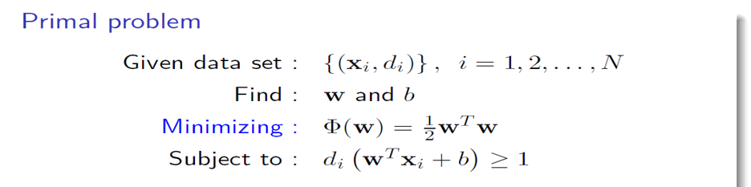
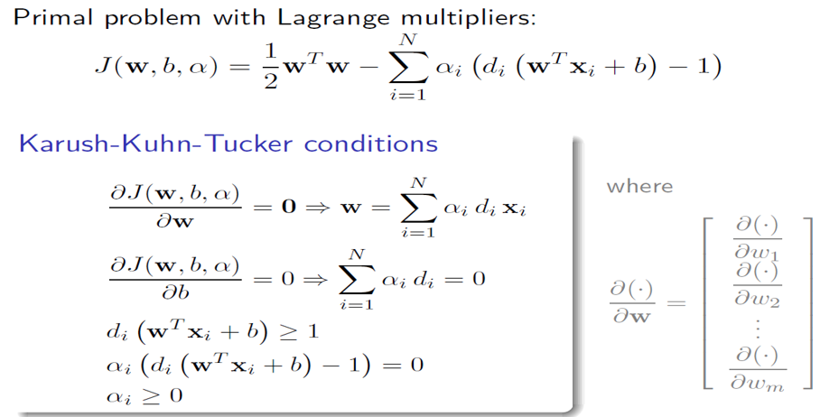
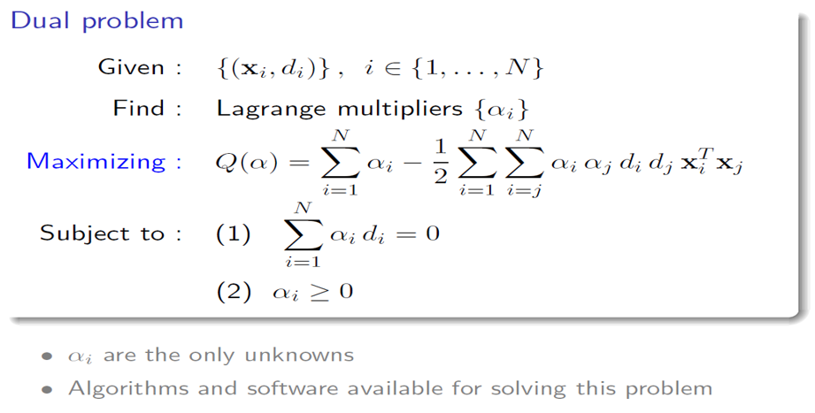
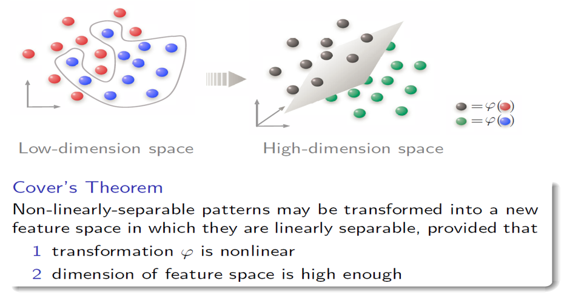

## 5-SVM

### 问题定义

寻找到一个超平面，使得数据离超平面尽可能的远。

### 问题转化：关键点

SVM关键在于将对 w,b​  的优化转化为了只对 w的优化

Margin 宽度 $r$ 与 $||w||$ 成反比，即： $r\propto \frac{1}{||w||}$

#### 推导

### 新的问题定义（要会推导）

对于有约束的优化问题，采用拉格朗日乘子

**KKT条件（局部极值，可能不是最优）**

经推导后可得对偶问题：

**画图**

考法：给几个坐标，然后画出超平面和支持向量。

### 线性不可分

#### 升维

不需要知道升维后的向量形式，只需要知道kernel

kernel矩阵半正定

#### 引入松弛变量

对偶问题的变化：出现C

C是什么

* C大，惩罚大分类效果好
* 过小，可能优化不足

问题：

预测的时候时间复杂度高，O(1)到O(n) 

非线性SVM: 来新的数据，需要重新算 O(n)

并行化，拆分成多个小数据多个svm 然后合成？

