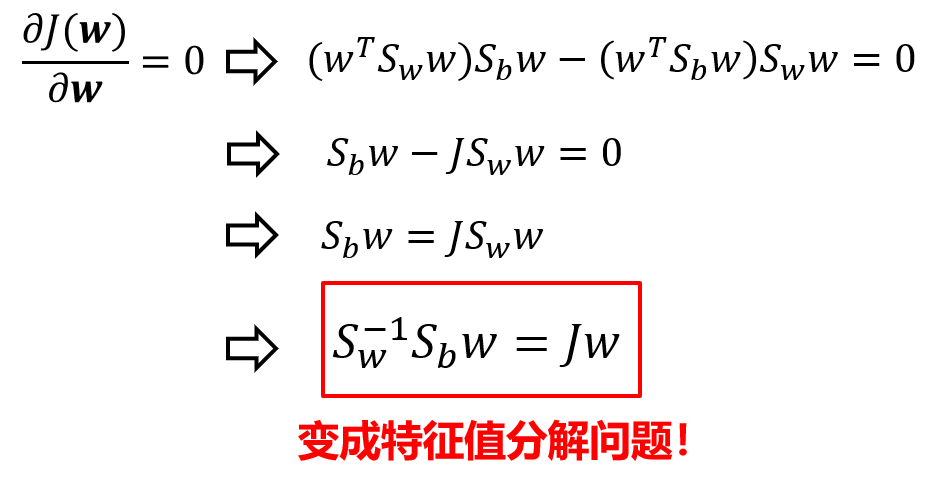

## LDA

**LDA 即 Linear Discriminant Analysis 线性判别分析，寻找映射方向w将数据进行预处理映射到新的空间，之后再用其它分类算法（SVM, KNN）。**

### Review

**投影矩阵**

假设 $a,b$ 均为 $d*1$ 的向量，则 $b$在$a$ 上的投影为：
$$
\begin{aligned}
proj &= \frac{aa^T}{a^Ta}b\\
&=\frac{a^Tb}{a^Ta}a
\end{aligned}
$$
若将$a$推广为矩阵，则 $b$在$a$ 列空间上的投影为：
$$
\begin{aligned}
proj &= a(a^Ta)^{-1}a^T{}b\\
\end{aligned}
$$
同时注意到投影矩阵$ a(a^Ta)^{-1}a^T$的特征值为 0、1。

### 算法目的

将原始数据映射到新的空间，新的空间中“同类近、异类远”(类间距离大，类内距离小）。

### 算法推导

类间距离：
$$
\begin{aligned}
d_B&=|w^Tu_1-w^Tu_2|^2\\
&=(w^Tu_1-w^Tu_2)(u_1^Tw-u_2^Tw)\\
&=w^T(u_1-u_2)(u_1-u_2)^Tw\\
&=w^TS_Bw\\
其中\ S_B &= (u_1-u_2)(u_1-u_2)^T 类间散射矩阵
\end{aligned}
$$
类内距离：
$$
\begin{aligned}
d_W&=w^TS_Ww\\
&=w^T(\sum_1+\sum_2)w\\
其中 \sum_{1,2} &=第一/二类样本协方差矩阵\\
S_W&=类内散射矩阵
\end{aligned}
$$
优化目标变为
$$
\max J(w)= \frac{w^TS_Bw}{w^TS_Ww},\ 求 w
$$

**最优的w即为最大的特征值所对应的那个特征向量！**

### 多维映射

### 多类问题LDA

对多类问题来说，类内散射矩阵不变，类间散射矩阵改变。

若类的个数是 $M$
$$
\ S_B =\sum_{j=1}^M N_j(u_j-u)(u_j-u)^T\\
u为全局中心
$$
此时

类的个数是$M$，$w$顶多有$M-1$个有意义

对于$M$个类，LDA至多降到$M-1$维。

