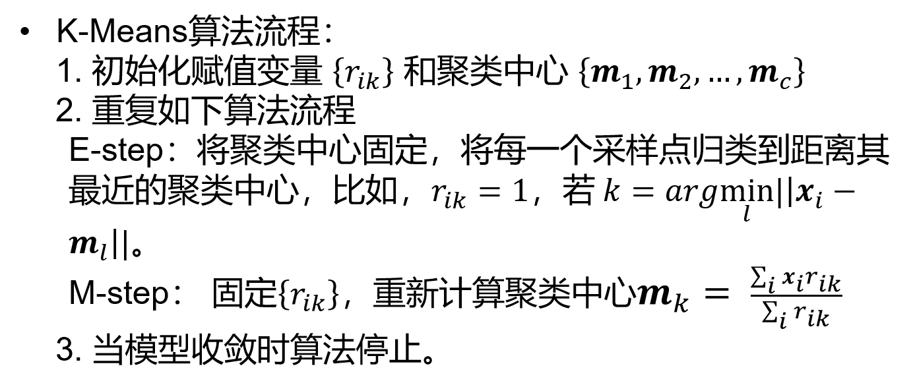
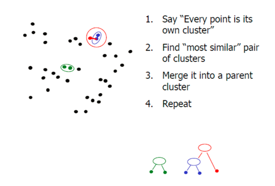

## 7-K-Means

**K-Means（K均值算法）是一种无监督的聚类算法，即将无标签的原始数据按照间距大小分为 $k$ 个类别。**

### 算法过程

设中心-----确定分类-------根据分类求新中心------循环

K-means分为两个阶段：

* E-step：固定聚类中心，将每一个点归到最近的聚类中心。
* M-step：固定每个采样点分配到的类，重新计算聚类中心。

计算复杂度：

给定$N$个采样点，$K$个类

E-step: $O(NK)$

M-step:$O(N)$

**收敛条件**：畸变程度
$$
E=\sum_{i=1}^k\sum_{x\in C_i}||x-\mu_i||_2^2\\
其中，\mu_i=\frac{1}{|C_i|}\sum_{x\in C_i}x 即聚类中心
$$
前后两次迭代的聚类中心没有发生改变。

### k的选择

k-means是以最小化样本与质点平方误差作为目标函数，将每个簇的质点与簇内样本点的平方距离误差和称为畸变程度(distortions)，畸变程度会随着类别的增加而降低，但对于有一定区分度的数据，**在达到某个临界点时畸变程度会得到极大改善，之后缓慢下降，这个临界点就可以考虑为聚类性能较好的点**。 基于这个指标，我们可以重复训练多个k-means模型，选取不同的k值，来得到相对合适的聚类类别。

### 并行计算

采用MapReduce方法，map函数分配每个样本到最近的中心，reduce函数负责聚类中心的更新。

### Agglomerative Clustering

自下而上

