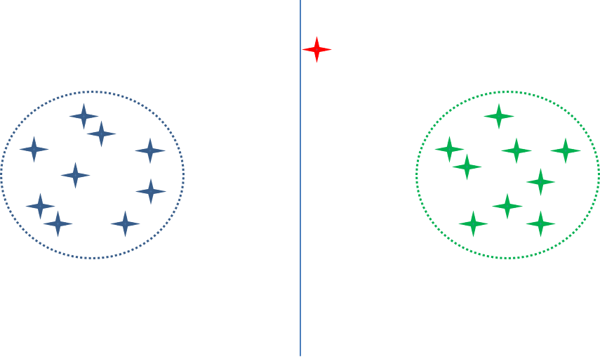
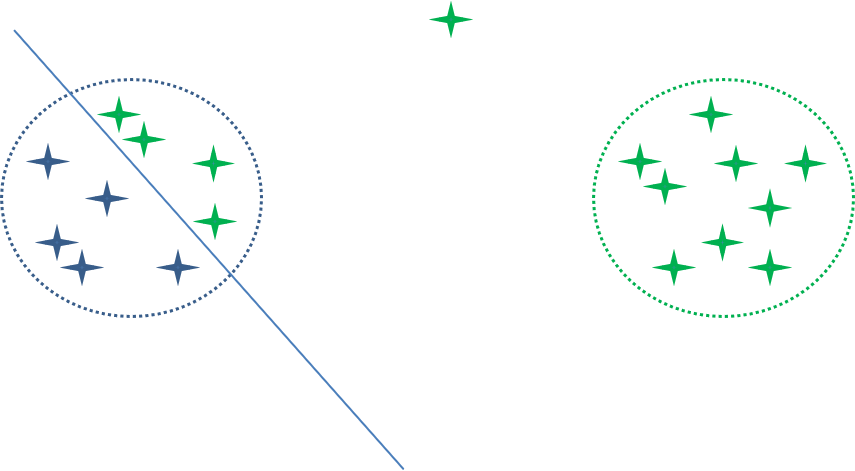
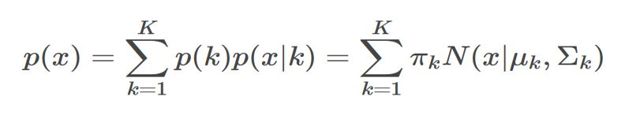
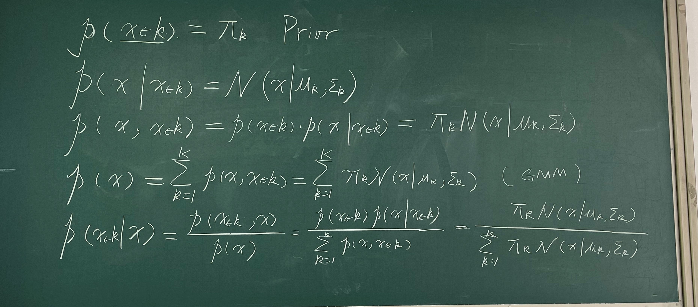
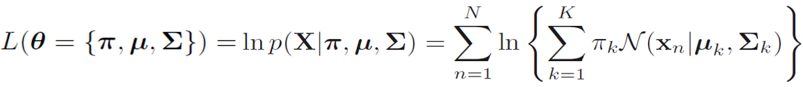
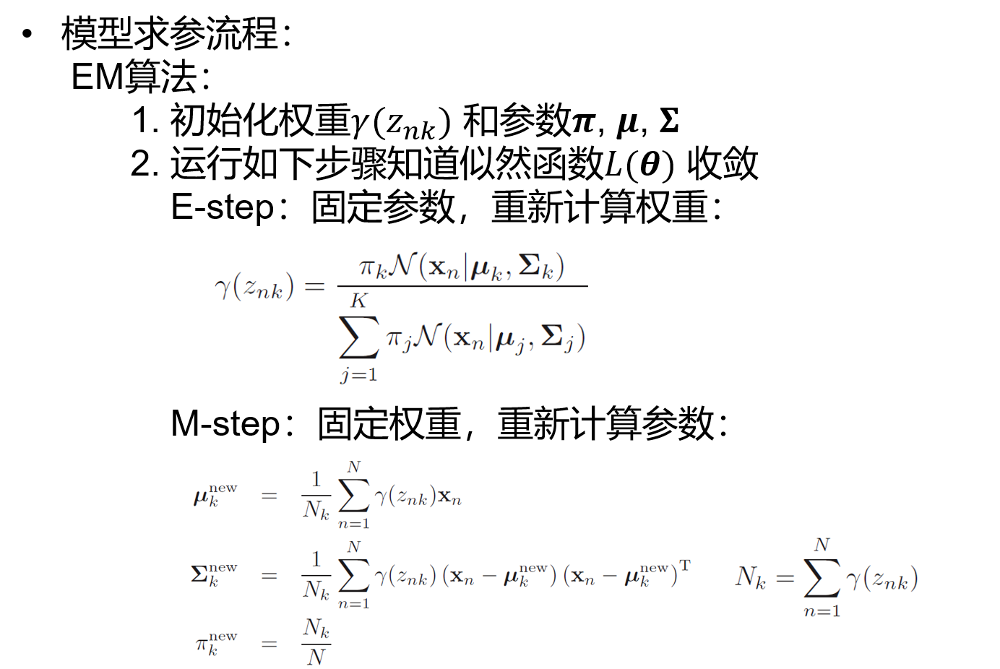
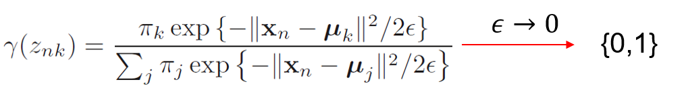

## 8-GMM

### K-means算法的缺陷

对数据太敏感，因为对所有数据进行明确的分类，因此如果样本数据发生很小的扰动，那么分类结果容易发生明显的改变。

解决方案：将样本以概率的形式来分类。

### GMM

混合高斯分布

在GMM中，每一类都对应一个高斯模型，GMM算法就是需要确定每个高斯模型的

* 权重 $\pi_k$
* 均值 $\mu_k$，方差 $\Sigma_k$(多维：协方差矩阵)

GMM先后验概率

#### 参数估计

为了求得k个高斯模型的参数，我们使用极大似然法

极大似然法则：

极大似然估计，通俗理解来说，**就是利用已知的样本结果信息，反推最具有可能（最大概率）导致这些样本结果出现的模型参数值！**

对于观测值 $x_i$
$$
p(x_i)=\sum_{i=1}^k\pi_kp(x_i|\mu_k,\Sigma_k)\\
\max \prod_{i} p(x_i)
$$
损失函数采用对数似然

之后通过拉格朗日乘子法算出$\pi,\mu,\Sigma$ 的迭代公式。

#### 算法过程

EM（Expectation-Maximization算法），和K-Means类似。

* E-step：算后验概率
* M-step：根据后验概率更新参数

### GMM和K-Means

*  GMM可以认为是一种平滑过的K-Means方法

  * 当方差接近0时，GMM变成K-means

  

* 两种方法都只能处理“凸性”数据

