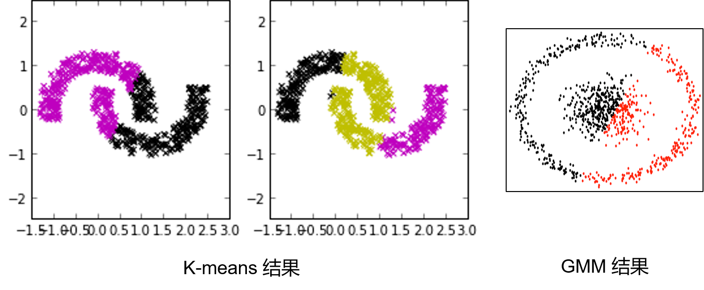
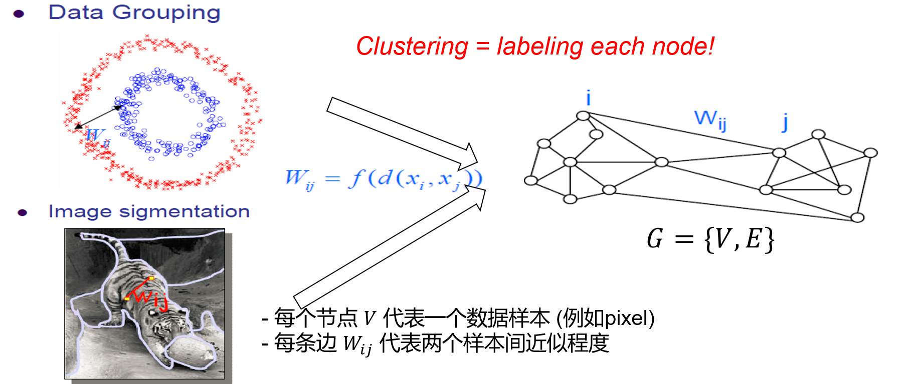
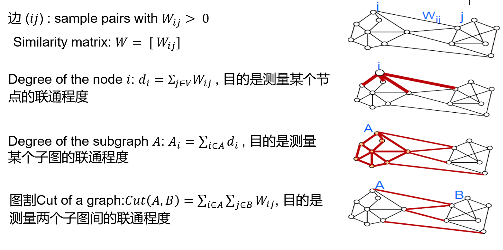
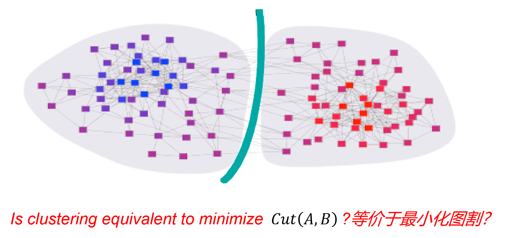

## 9-谱聚类

### 背景

K-means和GMM算法的缺陷：当数据属于非凸条件时效果较差。

### 算法过程

#### 整体思路

1. 构图
   1. 一定规则建图得邻接矩阵 W
   2. 阶矩 D，拉普拉斯矩阵 L = D-W
2. 切图：图割问题变成特征值分解
   1. 归一化的图割
   2. 引入$x$，图割的矩阵表示 $x^T(D-W)x$
   3. 特征值分解

#### 建图

我们采用$W_{ij}$ 越大越相似（对向量距离取负+指数 $e^{-x}$）。

补充定义

#### 图割

在此情况下，我们将聚类问题转化为图割问题：

找图的最小割

存在的问题：图割的数据分布不平衡

解决方法：归一化图割（Ncut）

### 总结

* 优势
  * 谱聚类只需要数据之间的相似度矩阵
  * 可以解决非凸数据
* 缺点
  * 计算量大
  * 聚类效果依赖于相似矩阵，不同的相似矩阵得到的最终聚类效果可能很不同。

**非凸数据**

最小割 不行-----------》normalized cut 矩阵分解

